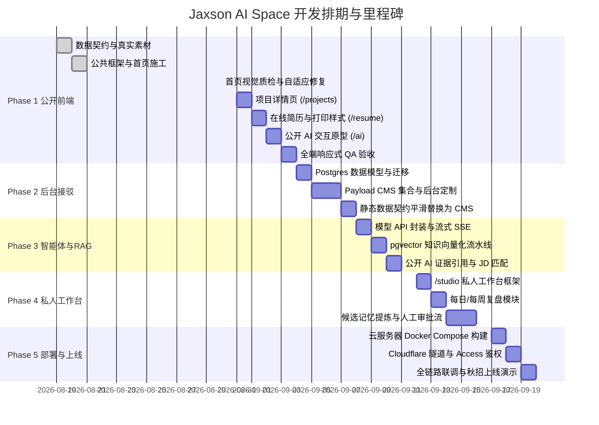

# Jaxson AI Space 全栈项目规划与研发排期方案

> **版本**：v2.0 (重新梳理与排期版)  
> **制定日期**：2026-08-29  
> **负责人**：张锦鹏 (Jaxson)  
> **项目定位**：双面智能体系统 —— 对外面向求职（高品质个人作品集 + 极简无痕公开 AI 分身），对内面向成长（个人复盘工作台 + 人工确认闭环的长期记忆库）。

---

## 一、 技术栈选型与架构规范

为避免“重复造轮子”并兼顾高性能、易维护与轻量部署，技术栈选型锁定如下：

| 分层领域 | 核心技术选型 | 版本/方案 | 选型理由与职责 |
|---|---|---|---|
| **全栈框架** | Next.js (App Router) | 15.x + React 19 + TypeScript | SSR/SSG 混合渲染，极速的首屏加载与优秀 SEO；统一处理前端路由与轻量服务端接口。 |
| **样式与视觉** | Vanilla CSS + 现代 CSS 变量 | 现代 CSS (CSS Grid, Flex, Custom Properties) | 拒绝通用死板的模板感，实现高质感深色/浅色、响应式、精细微动效与打印样式 (Print CSS)。 |
| **内容管理 (CMS)** | Payload CMS | 3.x (Next.js 原生嵌入模式) | 无缝嵌入 Next.js，代码即 Schema，支持草稿、实时预览、版本回滚与发布 Hook。 |
| **数据库** | PostgreSQL + pgvector | PostgreSQL 17 + pgvector 0.8.6 | 关系型业务数据与向量嵌入统一存储，避免引入额外向量库维护复杂度。 |
| **数据模式隔离** | 双 Schema 隔离 | `public_read` 与 `owner_private` | 物理隔离公开数据与私人数据，公开端智能体在数据库层面只有只读权限。 |
| **大模型能力** | 多模型适配层 | DeepSeek V3/R1、OpenAI GPT-4o、Claude 3.5 | 统一抽象 API Client，支持流式输出 (SSE)、结构化 JSON 提取与降级重试。 |
| **向量检索与 RAG** | 混合检索 (Dense + Sparse) | pgvector 向量检索 + 关键词元数据过滤 | 严格引用标注（来源可追溯到项目/经历/文章 ID），无证据时拒绝胡编。 |
| **容器与部署** | Docker Compose + Caddy | Docker Compose / Ubuntu 24.04 (2核4G) | 轻量容器化部署，反向代理与自动 HTTPS 证书申请。 |
| **网络与安全** | Cloudflare Tunnel + CF Access | Cloudflare Zero Trust | 免公网暴露服务器端口，私人工作台 (`/studio`) 挂载 Cloudflare 鉴权保护。 |
| **对象存储与备份** | S3 兼容对象存储 (R2 / OSS) | 外部对象存储 + pg_dump 定时加密备份 | 存储高清截图、简历 PDF/Word，数据库每日自动加密备份。 |

---

## 二、 系统功能全景拆解（三层架构）

```
Jaxson AI Space
├── 🌐 1. 对外公开端 (Public Facing) —— 极简、真实、高信任度
│   ├── [1.1 首页 (/)] 个人核心定位、经历时间线(润喵云实习)、精选项目网格、技能/荣誉、联系方式
│   ├── [1.2 项目详情 (/projects/[slug])] 真实展示项目背景、难点、技术架构与成果（Demo/二开/私有探索边界隔离）
│   ├── [1.3 在线简历 (/resume)] 结构化网页简历、Word/PDF 下载、专用浏览器打印排版 (Print CSS)
│   └── [1.4 公开 AI 分身 (/ai)] 类 ChatGPT/豆包单输入框体验、自动 JD 匹配模式、严格证据来源引用、无会话残留
│
├── 🔐 2. 对内私人端 (/studio) —— 高度私密、助力个人成长
│   ├── [2.1 私人智能体对话] 具备全部上下文与工具链的专属数字分身
│   ├── [2.2 个人复盘工作台] 每日/每周复盘输入，结构化提取个人收获与待改进项
│   ├── [2.3 候选记忆审批流] 对话/复盘中提炼的记忆必须经过【人工确认/修改/合并】才入库
│   ├── [2.4 目标与行动追踪] 秋招投递进度、技能学习目标、待办事项跟踪
│   └── [2.5 系统观测与知识管理] 向量索引状态监控、Token/成本统计、内容发布与版本管理
│
└── ⚙️ 3. 后台服务与数据中枢 (Backend & Workers)
    ├── [3.1 Payload CMS 核心] 内容建模、权限控制、草稿/发布工作流
    ├── [3.2 向量化与检索 Worker] 监听发布事件，自动分块、生成 Embedding 并更新检索索引
    └── [3.3 自动化流水线] 每日数据库备份、定期数据体检、安全审计
```

---

## 三、 研发实施路线与排期表（分阶段 Milestone）

采用 **“前端先行 (Frontend-First) ➔ 后端接驳 (CMS & DB) ➔ 智能体与记忆闭环 ➔ 云端上线”** 的敏捷迭代节奏：

### 阶段规划概览

| 阶段 (Phase) | 核心目标 | 预估周期 | 交付物标准 | 状态 |
|---|---|---|---|---|
| **Phase 1: 前端先行与公开产品** | 完成全部公开页面前端 UI/UX，在浏览器跑通高保真体验 | 4~5 天 | 首页、项目详情、简历页、公开 AI 交互原型均可交互，全端自适应无错 | 🟡 进行中 (50%) |
| **Phase 2: 内容中枢与真实数据流** | 接入 Payload CMS 与 PostgreSQL，实现内容后台发布与静态契约平滑替换 | 3~4 天 | 管理后台可在线编辑项目/简历，发布后自动更新前台与静态缓存 | ⚪ 待开始 |
| **Phase 3: 公开 AI 检索与真实 RAG** | 接入 pgvector 与大模型流式 API，实现真实的 JD 匹配与证据检索 | 3~4 天 | `/ai` 接入真实大模型流式对话，支持长文本 JD 结构化分析与准确引用 | ⚪ 待开始 |
| **Phase 4: 私人工作台与记忆闭环** | 构建 `/studio`、复盘工作流与候选记忆人工确认审批系统 | 4~5 天 | 跑通“复盘输入 ➔ 提取候选记忆 ➔ 人工确认入库 ➔ 私人检索召回”完整闭环 | ⚪ 待开始 |
| **Phase 5: 部署上线与安全加固** | 云服务器 Docker 部署、Cloudflare 安全穿透与定时备份配置 | 2~3 天 | 生产环境域名可访问，CF Access 鉴权生效，完成端到端求职演练 | ⚪ 待开始 |

---

### 详细任务排期与责任清单 (WBS)



---

## 四、 关键阶段详细任务分解与验收指标

### 【Phase 1】公开端前端产品化（当前阶段）
* **Task 1.1（已完成）**：数据契约建立 (`types.ts`, `content.ts`)，7 项单元测试通过。
* **Task 1.2（已完成代码）**：首页组件编写 (`header`, `footer`, `project-list`, `reveal`, `styles.css`)。
* **Task 1.3（下一步）**：首页浏览器多分辨率（1440px / 768px / 390px）视觉与自适应验收。
* **Task 1.4**：3 个项目的独立详情页开发（重点：Demo / 二开 / 私有探索的真实边界提示）。
* **Task 1.5**：独立在线简历页（包含 Word 下载按钮及专用 `@media print` 打印样式）。
* **Task 1.6**：公开 AI 前端原型页（无侧边栏、单输入框、支持快捷提问、输入大段文字自动转为 JD 匹配卡片）。
* **阶段验收标准**：无需启动后端数据库，前端可在本地完整浏览，UI 质感高级无拉伸、无横向滚动条。

### 【Phase 2】CMS 与真实数据流动
* **Task 2.1**：PostgreSQL 初始化，配置 `public_read` 和 `owner_private` 角色权限。
* **Task 2.2**：Payload 集合建模（Projects, Experience, Skills, Awards, ResumeInfo, Media）。
* **Task 2.3**：实现发布 Hook：CMS 点击“发布”后，触发静态页面重验证 (On-demand Revalidation)。
* **阶段验收标准**：在 `/admin` 后台修改项目介绍或经历，前台页面刷新即可同步更新。

### 【Phase 3】公开 AI 知识检索与 JD 匹配
* **Task 3.1**：知识库切片（Chunking）与向量化脚本（接入 DeepSeek / OpenAI Embedding）。
* **Task 3.2**：构建混合检索逻辑：根据提问检索 top-k 相关经历/项目段落。
* **Task 3.3**：JD 解析 Prompt 与卡片渲染（提取“匹配度评估”、“对应优势证据”、“技能缺口说明”）。
* **阶段验收标准**：粘贴真实岗位 JD，AI 能在 3 秒内流式输出匹配分析，并在回答末尾附带精准的可点击项目证据链接。

### 【Phase 4】私人工作台与记忆闭环
* **Task 4.1**：构建 `/studio` 页面框架（对话、复盘、记忆、目标 4 个 Tab）。
* **Task 4.2**：复盘记录提交 ➔ 触发 AI 提取候选记忆 ➔ 展示在“待确认看板”。
* **Task 4.3**：人工点击【确认】后写入正式记忆表，并生成私人向量索引；支持修改与删除。
* **阶段验收标准**：私人对话能精准回忆已确认的经历，且公开端永远检索不到私人标记数据。

### 【Phase 5】生产部署与安全保障
* **Task 5.1**：编写生产环境 `compose.prod.yaml` 与 `Caddyfile`。
* **Task 5.2**：配置 Cloudflare Tunnel 与 Cloudflare Access（仅允许你的认证邮箱访问 `/studio` 与 `/admin`）。
* **Task 5.3**：配置每日数据库自动备份至 S3 对象存储脚本。
* **阶段验收标准**：通过公网域名访问，手机端与 PC 端流畅，外部直接访问 `/studio` 会被拦截并重定向至 CF 登录页。

---

## 五、 质量守则与“明确不做”清单

### 核心质量守则
1. **真实性第一**：所有项目经历、实习起止时间（`2026.06 - 2026.08`）绝不造假、不夸大成成熟商业产品。
2. **渐进式交付**：每一阶段必须有可运行、可测试、可展示的成果，不留半成品。
3. **安全物理隔离**：公开接口与数据库角色永远不允许接触未发布数据与私人记忆。

### 明确不做清单 (避免无意义内耗)
1. ❌ 不在第一、二阶段训练或微调超大参数模型。
2. ❌ 不让公开端智能体拥有长期访客记忆或账号系统（访客即走即清）。
3. ❌ 不自动将私人复盘或未经人工确认的记忆发布到网站。
4. ❌ 不搞复杂的付费、多租户或超大规模微服务集群。
