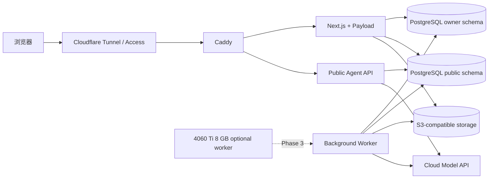
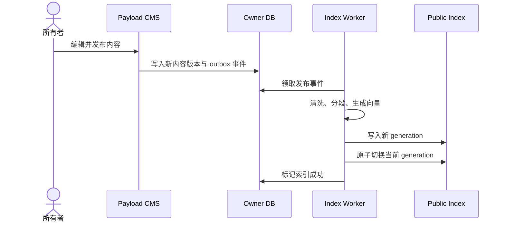
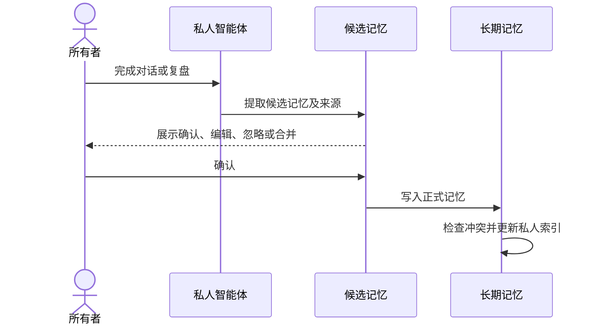

# Jaxson AI Space 项目架构设计

- 状态：已确认设计
- 日期：2026-08-21
- 工作名称：Jaxson AI Space
- 第一目标：用于中国秋招的个人简历、作品集和公开 AI 分身
- 长期目标：形成可持续维护的私人数字分身、复盘和记忆系统

## 1. 项目定位

Jaxson AI Space 是一个由张锦鹏本人维护的个人数字空间。它不是通用聊天机器人，也不是把多个 Demo 放在一起的导航页，而是同时服务两个明确场景：

1. 对外求职：招聘方通过个人简历、项目案例和公开 AI 分身快速了解候选人，并可粘贴岗位 JD 获得有证据的匹配分析。
2. 对内成长：本人通过私人智能体完成日常记录、复盘、长期记忆确认和目标追踪，并统一维护公开内容。

系统必须始终保证公开内容与私人记忆隔离。公开智能体只能使用本人明确发布的资料，不能读取私人复盘、草稿、未发布项目或原始文件。

## 2. 设计原则

### 2.1 公开页面首先是一份优秀的个人简历

公开首页沿用 `resume-portfolio-cn` 当前版本的黑色、白色和黄色视觉语言，不改造成 AI 产品后台。访客无需理解系统架构，只会看到自然的个人介绍、经历、作品、能力和联系方式。

AI 分身是公开简历的增强入口。首页新增“和我的 AI 分身聊聊”按钮，点击后进入独立 `/ai` 页面。

### 2.2 AI 回答必须可验证

公开智能体不把模型记忆当事实。所有关于经历、项目和技能的关键结论必须来自已发布内容，并附带可点击的来源。没有证据时必须明确回答“公开资料中没有足够信息”。

### 2.3 私人记忆必须由本人确认

模型只能生成候选记忆，不能静默写入长期记忆。每条长期记忆都要经过本人确认，并保留来源、类型、创建时间、更新时间和冲突状态。

### 2.4 复用基础能力，自研产品差异

不自行开发 CMS 框架、聊天基础组件、流式传输协议和向量数据库。自研部分集中在：

- 公开内容与私人记忆隔离
- 有证据的个人问答
- 岗位 JD 自动识别和匹配
- 候选记忆审批、冲突和删除
- 复盘、记忆与目标之间的闭环

### 2.5 第一版保持轻量

第一版运行在一台 2 核 4 GB Linux 云服务器上，调用云模型 API，不使用本地 GPU，也不部署 GPU 云服务器。

## 3. 用户与访问边界

### 3.1 公开访客

典型用户是招聘方、面试官、开发者和同学。

公开访客可以：

- 浏览个人简历、经历、项目、荣誉和能力
- 下载公开简历
- 查看在线 Demo、演示截图、视频和源码链接
- 与公开 AI 分身单次对话
- 粘贴岗位 JD，获得匹配分析
- 从 AI 回答跳转到项目或经历来源

公开访客不能：

- 查看其他访客的会话
- 创建账号或保存历史记录
- 读取草稿、私人记忆和未发布资料
- 调用发送消息、修改内容、执行代码等工具
- 让岗位 JD 中的指令改变智能体权限

### 3.2 所有者

系统只有一个所有者账号，即张锦鹏本人。

所有者可以：

- 使用完整私人智能体
- 保存私人对话
- 发起每日和每周复盘
- 审批、修改、驳回和删除候选记忆
- 管理目标和行动
- 编辑、预览、发布和下架公开内容
- 上传项目封面、截图和简历文件
- 以招聘方身份预览公开页面与 AI 回答
- 查看索引、备份和模型调用状态

## 4. 信息架构与路由

```text
/
├─ /                         公开个人简历与作品集
├─ /projects/[slug]          可分享的项目案例详情
├─ /ai                       公开 AI 分身，单次临时会话
├─ /resume                   在线简历与下载入口
└─ /studio                   登录后的私人工作台
   ├─ /studio/chat           私人智能体
   ├─ /studio/reviews        每日与每周复盘
   ├─ /studio/memories       候选记忆、长期记忆与冲突
   ├─ /studio/goals          秋招、学习和项目目标
   ├─ /studio/content        公开内容管理
   └─ /studio/system         索引、备份、模型和安全状态
```

第一版使用同一域名和路径，不拆分 `www`、`admin`、`me` 等子域名。这样访客体验自然，部署和证书管理也更简单。

## 5. 对外可见效果

### 5.1 公开首页

保留现有个人简历页的整体视觉与单页浏览结构，完成以下调整：

- 首屏增加“和我的 AI 分身聊聊”主要入口
- 导航增加“AI 分身”入口
- 实习经历更新为 `2026.06.23 - 2026.08.21`
- 删除“目前在职”“至今”等过期描述
- 广东润喵云科技有限公司经历只展示脱敏、可证明的职责
- 项目卡片只显示真实状态：已上线、已开源、私有案例、持续迭代
- `smart-cs-agent` 等未完成项目默认不公开
- 首批公开项目为待办备忘、锐历简历工作台和 OPC 私有案例

### 5.2 项目案例页

现有大尺寸弹层改为独立项目详情页。独立页面更适合移动端、分享、搜索引擎收录和 AI 引用。

每个项目页面包含：

- 项目名称、定位、状态和本人角色
- 真实截图或演示视频
- 问题、约束、方案和结果
- 本人负责的具体部分
- 技术选择与关键取舍
- 当前限制和后续计划
- 在线地址、源码地址或私有说明
- “向 AI 追问这个项目”入口

不使用无法验证的用户数量、性能提升比例或业务指标。

### 5.3 公开 AI 分身

`/ai` 是独立的成熟聊天页面，不使用侧边栏，不展示最近对话，也不套用作品集卡片布局。

初始状态包含：

- 一句简短问候
- 一个自动增高的输入框
- 三个个人经历快捷问题
- 一个“粘贴岗位 JD 并分析匹配度”快捷入口
- “公开模式、单次会话”的隐私说明
- 新建会话、主题切换和返回简历

岗位 JD 不作为显式模式或胶囊按钮。点击快捷入口只聚焦输入框并提示粘贴岗位描述；服务端根据文本结构自动识别 JD 意图。

发送后提供：

- 流式生成状态
- 停止生成
- 复制回答
- 重新生成
- 继续追问
- 项目和经历来源引用
- 无足够证据时的明确拒答

桌面端和移动端采用同一条消息流。手机端输入区固定在安全区域上方，文本、按钮和来源卡不能遮挡。

### 5.4 JD 匹配结果

岗位匹配不输出缺乏依据的精确百分比。结果使用以下结构：

1. 总体判断：高匹配、部分匹配或暂不匹配
2. 已匹配要求：每项附公开经历或项目证据
3. 可迁移能力：说明为什么相关
4. 能力缺口：只陈述公开资料无法证明的部分
5. 面试建议：建议招聘方继续追问的问题
6. 来源：链接到对应项目、经历和能力条目

页面明确提示：岗位文本会发送给配置的模型服务用于本次分析，本站不保存原始 JD。

## 6. 私人工作台效果

### 6.1 工作台结构

私人端采用“对话为主，内容可管理”的结构，不做复杂数据看板。

- 对话：完整私人智能体与历史对话
- 复盘：每日记录、周总结和行动确认
- 记忆：候选、已确认、冲突、可能过期和归档
- 目标：秋招、学习和项目目标
- 内容：公开简历、项目、荣誉、技能和媒体

### 6.2 每日复盘流程

```text
开始今日复盘
  → AI 询问今天完成了什么
  → AI 追问困难、收获和未完成事项
  → 生成结构化复盘草稿
  → 本人修改并确认
  → 更新行动项
  → 生成候选记忆
  → 本人确认后写入长期记忆
```

复盘内容和候选记忆是两个独立对象。确认复盘不等于自动确认所有记忆。

### 6.3 记忆控制中心

每条候选或长期记忆包含：

- 记忆内容
- 类型：事实、偏好、目标、经验、人物或项目
- 来源：对话、复盘、文件或手工输入
- 来源时间和可跳转位置
- 提取原因
- 状态：待确认、已确认、存在冲突、可能过期或归档
- 创建时间和最后更新时间
- 使用范围：仅私人

审批操作包括：

- 确认
- 编辑后确认
- 忽略
- 合并
- 标记过期
- 删除

新内容与旧记忆冲突时，系统创建冲突记录，不自动覆盖。本人选择保留旧值、采用新值或并存。删除记忆时同时删除正文、向量和关联关系；审计记录只保留动作和匿名 ID，不保留被删除内容。

私人智能体回答时可展开“基于哪些记忆”，并可从回答处直接纠正来源记忆。

### 6.4 目标闭环

目标包含目标描述、期限、状态、当前进度、关联项目和下一步行动。

每日复盘可以关联目标，但不会自动修改目标完成状态。AI 可以提出更新建议，本人确认后生效。

## 7. 内容管理与公开知识库

### 7.1 内容类型

管理后台维护以下正式内容：

- Profile：姓名、求职方向、所在地、联系方式和个人简介
- Experience：教育、实习和早期经历
- Project：项目详情、状态、角色、技术、截图和链接
- Award：奖项、级别、时间和说明
- SkillGroup：能力分组和证据
- ResumeAsset：当前公开简历文件
- PublicFact：适合公开 AI 引用的补充事实

### 7.2 发布流程

```text
编辑内容
  → 保存草稿
  → AI 检查事实一致性和表述
  → 招聘方视角预览
  → 本人发布
  → 创建新的公开内容版本
  → 后台任务分段并生成向量
  → 原子切换到新索引版本
```

修改已发布内容时，线上继续使用旧版本，直到新版本发布并完成索引。索引失败时保留上一可用版本并在工作台告警。

下架内容后，页面立即不再展示；公开检索索引根据内容 ID 删除对应片段。重新发布会生成新版本。

### 7.3 数据层级

系统维护三类数据，互不替代：

| 数据层 | 权威来源 | 用途 |
|---|---|---|
| 公开内容库 | 本人发布的 CMS 内容 | 页面展示和公开问答 |
| 私人记忆库 | 本人确认的长期记忆 | 私人对话、复盘和目标 |
| 原始资料库 | 上传文件、截图和简历 | 作为人工管理的原始资产 |

向量索引是可删除、可重建的派生数据，不是权威来源。管理员无需手工维护向量。

## 8. 技术选型与开源复用

### 8.1 采用的基础组件

| 组件 | 作用 | 采用理由 |
|---|---|---|
| Next.js + TypeScript | 公共页面、Studio 和服务端接口 | 单仓库维护，适合 React 组件与服务端渲染 |
| Payload CMS | 管理后台、身份、草稿、版本、媒体和权限 | 避免自研 CMS，MIT，Next.js 原生 |
| assistant-ui | 公开和私人聊天交互 | 避免自研消息流、输入框、流式状态和可访问性 |
| PostgreSQL | 权威业务数据 | 同时支持 CMS、记忆、目标和审计 |
| pgvector | 公开知识和私人记忆检索 | 不增加独立向量数据库 |
| OpenAI 兼容模型适配器 | DeepSeek、豆包等云模型 | 模型可替换，不绑定单一供应商 |
| S3 兼容对象存储 | 图片、简历和加密备份 | 避免在 2 核 4 GB 主机自建 MinIO |
| Cloudflare Tunnel + Access | 公开入口和 Studio 保护 | 源站无需开放 Web 入站端口，私人路径增加身份门禁 |
| Caddy | 容器内部路由和安全响应头 | 配置简单、便于统一代理 |

### 8.2 暂不作为基础的完整平台

- Khoj：适合作为个人知识助手参考，但整体产品、AGPL 许可和界面边界不适合直接嵌入个人简历。
- Second-Me：理念接近，但主要围绕本地训练和身份网络，维护活跃度与轻量云部署路线不匹配。
- Dify、FastGPT、MaxKB、RAGFlow：适合通用企业知识库和工作流，但部署组件和后台概念超出本项目需要。
- Open WebUI、AnythingLLM、Cherry Studio：适合通用聊天客户端，不负责个人简历内容管理和严格公开/私人隔离。
- Mem0、Letta：作为第二阶段记忆实现参考；只有在不破坏“候选记忆必须确认”的前提下才引入。

### 8.3 必须自研的领域模块

- `public-profile`：公开简历和作品数据映射
- `public-agent`：只读公开资料的问答和 JD 分析
- `publishing`：草稿、发布版本和索引切换
- `memory-review`：候选记忆审批和冲突处理
- `retrospective`：日复盘与周复盘流程
- `goals`：目标与行动建议确认
- `evidence`：答案与内容来源之间的引用关系

## 9. 运行架构

代码采用单一仓库、清晰模块和少量独立进程。公开 Agent 使用独立运行进程和受限数据库账号，避免与私人数据共享运行权限。



### 9.1 运行进程

1. `web`：Next.js、Payload、公开页面和 Studio。
2. `public-agent`：无状态公开问答，只持有公开数据库只读凭据和模型凭据。
3. `worker`：内容索引、候选记忆提取、定时复盘和备份检查。
4. `postgres`：业务数据和 pgvector。
5. `caddy`：内部反向代理和响应头。
6. `cloudflared`：连接 Cloudflare，不向公网直接暴露 Web 容器。

第一版不部署 Redis、Kafka、独立向量数据库和本地模型服务。任务队列使用 PostgreSQL 持久化队列和事务 outbox。

## 10. 数据模型

### 10.1 公开内容

```text
profiles
experiences
projects
project_media
awards
skill_groups
resume_assets
public_facts
content_versions
public_documents
public_chunks
```

所有公开记录包含 `status`、`published_at`、`version` 和稳定内容 ID。`public_chunks` 只能引用已发布版本。

### 10.2 私人数据

```text
private_conversations
private_messages
reviews
review_actions
goals
goal_updates
memory_candidates
memories
memory_sources
memory_conflicts
private_chunks
```

`memory_candidates` 与 `memories` 分表，避免未确认内容被私人智能体当成事实。`private_chunks` 只能引用已确认记忆或本人明确允许检索的私人文件。

### 10.3 系统数据

```text
index_generations
job_queue
outbox_events
audit_events
model_usage_daily
backup_runs
```

审计日志不保存公开访客原始提示词、岗位 JD 或已删除记忆正文。

## 11. 核心数据流

### 11.1 发布和公开索引



### 11.2 公开问答

1. 浏览器发送当前会话最近 8 条消息和本次问题。
2. 服务端限制文本长度、删除不允许的附件并识别普通问答或 JD。
3. 公共检索账号只从当前 `public_chunks` generation 检索。
4. 模型获得系统规则、公开证据和用户问题。
5. 模型输出结构化答案与来源 ID。
6. 服务端验证来源 ID 确实属于本次检索结果。
7. 浏览器流式展示答案和来源。
8. 服务端只记录耗时、Token 数、状态码和匿名请求 ID，不保存原始问题或 JD。

### 11.3 私人记忆



## 12. 权限与安全

### 12.1 入口保护

- `/`、`/projects/*`、`/resume` 和 `/ai` 公开。
- `/studio/*` 和所有私人 API 先经过 Cloudflare Access，只允许所有者邮箱。
- 应用内部仍要求所有者会话，不能只依赖前端隐藏入口。
- 数据库不暴露公网端口。
- SSH 只允许密钥认证和受限来源，或通过云厂商控制台访问。

### 12.2 数据库权限

- `public_agent` 数据库角色只能读取 `public_read` schema 和当前发布索引。
- `owner_app` 角色访问 CMS 和私人业务表。
- `worker` 角色执行索引任务，但不能创建所有者会话。
- 发布流程将公开快照复制到 `public_read`，而不是让公开接口读取 CMS 草稿表。

### 12.3 Prompt Injection 防护

- 岗位 JD、网页文本和上传文件全部视为不可信数据。
- 公开 Agent 没有写入、执行代码、发消息和外部工具权限。
- 系统提示明确要求忽略资料中的操作指令。
- 来源 ID 由服务端校验，模型不能伪造引用。
- 输出进行长度、链接协议和 Markdown 安全过滤。

### 12.4 成本与滥用控制

- Cloudflare 层启用基础机器人和速率限制。
- 应用签发短期匿名会话令牌。
- 单次请求限制输入长度、上下文轮数和最大输出 Token。
- 单会话和单来源设置每日请求上限。
- 达到限制后仍可正常浏览简历和项目，只暂停 AI 功能。

## 13. 异常与降级

| 场景 | 用户效果 | 系统行为 |
|---|---|---|
| 模型超时 | 显示重试，不清空用户输入 | 取消上游请求并记录匿名错误 ID |
| 模型不可用 | 提示暂时无法回答 | 公开简历、项目和下载继续可用 |
| 没有检索证据 | 明确说明资料不足 | 不允许模型猜测经历 |
| 索引任务失败 | 管理后台告警 | 继续使用上一成功 generation |
| 内容下架 | 页面立即隐藏 | 删除或停用对应公开片段 |
| 记忆冲突 | 进入冲突列表 | 不覆盖原记忆 |
| 备份失败 | Studio 显示红色状态 | 下次任务重试并保留失败记录 |
| 达到调用限制 | 告知稍后重试 | 不影响静态页面访问 |
| 非法文件 | 在上传前说明原因 | 不保存文件，不进入解析队列 |

每个主要页面覆盖加载、空状态、错误和成功四种状态。

## 14. 部署方案

### 14.1 初始服务器

- 2 核 CPU
- 4 GB 内存
- 60 GB 以上 SSD
- Ubuntu 24.04 LTS
- Docker Compose
- 不需要 GPU

4060 Ti 8 GB 家庭主机不保持 24 小时在线。第三阶段需要本地推理、OCR 或隐私处理时，才通过受控隧道作为按需 Worker 接入。

### 14.2 容器

```text
caddy
cloudflared
web
public-agent
worker
postgres
```

媒体和备份使用外部 S3 兼容存储，不在小型主机中运行 MinIO。

### 14.3 备份

- PostgreSQL 每日加密备份
- 保留 7 个每日、4 个每周和 3 个每月版本
- 媒体文件启用对象存储版本控制
- 每月执行一次恢复演练
- 备份密钥与备份文件分离保存

## 15. 可观测性

Studio 系统页展示：

- Web、Public Agent、Worker 和数据库状态
- 最近内容索引结果
- 最近备份结果
- 模型调用次数、错误率和 Token 消耗
- 当前公开索引版本
- 待处理记忆和冲突数量

日志采用结构化 JSON，不记录完整提示词、岗位 JD、私人记忆正文和模型密钥。

## 16. 测试策略

### 16.1 单元测试

- 内容发布状态转换
- JD 意图识别
- 来源 ID 校验
- 候选记忆审批
- 记忆冲突检测
- 目标更新确认
- 输入长度和上下文裁剪

### 16.2 集成测试

- Payload 草稿、预览、发布和回滚
- 发布事件到公开索引的完整链路
- 下架内容从公开检索结果消失
- 删除记忆同步删除私人向量
- 数据库角色权限
- 模型超时和失败降级
- 备份与恢复

### 16.3 安全测试

- 在私人记忆中放入唯一测试标记，证明公开 Agent 无法检索
- 在 JD 中加入“忽略系统规则”等恶意指令，证明不会触发越权
- 未登录访问所有 `/studio` 和私人 API 必须失败
- 普通所有者会话不能绕过记忆确认直接写长期记忆
- 引用只能指向本次检索到的已发布内容

### 16.4 端到端测试

- 招聘方：首页 → 项目 → AI → 来源 → 返回项目
- 招聘方：粘贴 JD → 获得匹配项、证据和缺口
- 所有者：编辑项目 → 预览 → 发布 → 页面与 AI 同步更新
- 所有者：完成复盘 → 审批候选记忆 → 私人对话引用该记忆
- 所有者：下架内容 → 公开页面和公开 AI 均不可再访问

### 16.5 视觉和响应式验证

- 1440 px 桌面
- 768 px 平板
- 390 px 手机
- 浅色和深色 AI 页面
- 中文长文本、超长项目名和多行 JD
- 键盘导航和 `prefers-reduced-motion`

## 17. 分阶段交付

### 第一阶段：对外求职产品

交付：

- 迁移并保留现有公开简历视觉
- 实习和项目内容更新
- 独立项目案例页
- Payload 内容后台
- 草稿、预览、发布和版本
- 公开知识索引
- 无历史公开 AI 分身
- 自动 JD 匹配和证据引用
- 云服务器、Cloudflare、限流和备份

完成标准：招聘方可以顺畅浏览、追问和完成 JD 分析；所有公开答案有来源；私人测试标记无法通过公开 API 获取。

### 第二阶段：私人数字分身

交付：

- 私人对话和历史
- 每日与每周复盘
- 候选记忆审批
- 来源追踪、冲突和删除
- 目标与行动管理
- Studio 系统状态页

完成标准：复盘能够产生候选记忆，但未经确认的内容永远不会成为长期记忆；每条回答可以追溯到记忆来源。

### 第三阶段：能力扩展

交付：

- Demo 生命周期管理
- 更多文件解析
- 定时提醒与外部工具
- 家庭 4060 Ti 按需 Worker
- 本地 OCR、语音或小模型
- 经确认的低风险自动化

## 18. 明确不做

第一、二阶段不包含：

- 训练或微调“完全替代本人”的模型
- 让公开智能体访问私人记忆
- 保存招聘方的原始 JD 和公开会话历史
- 为公开访客创建账号
- 自动代表本人发送邮件、投递简历或联系他人
- 自动将私人记忆发布到网站
- 部署所有未完成 Demo
- 24 小时运行家庭 4060 Ti
- 自建模型推理集群
- 复杂多租户、付费和组织权限

## 19. 已确认决策

- 采用模块化产品结构，但对外只有一个自然的个人简历入口。
- 公开 AI 使用独立 `/ai` 页面，不使用侧边抽屉。
- 公开 AI 无历史侧栏、无账号、无跨访客记忆。
- JD 由系统自动识别，不提供显式模式按钮。
- 私人工作台以对话为主，复盘、记忆、目标和内容可管理。
- 长期记忆默认全部人工确认。
- 公开内容库和私人记忆库分离，向量索引可重建。
- 管理后台负责草稿、预览、发布和知识库同步。
- Demo 采用混合部署。
- 第一版使用 2 核 4 GB 云服务器和云模型 API。
- 使用 Payload、assistant-ui、PostgreSQL 和 pgvector，避免重复开发基础设施。

